> **DXChart 개발자 튜토리얼**
>
> **(Nexacro용)**
---

**\[목 차\]**
각각의 목차를 클릭시 해당 페이지로 이동합니다


[**3.** **Effect 설정하기**](#effect-설정하기)

- [**Effect 설정하기**](#effect-설정하기)
    - [Draw](#draw)
    - [drawAni](#drawani)
    - [wave](#wave)
    - [grow](#grow)
    - [trace](#trace)
    - [unfold (toBottom)](#unfoldtobottom)
    - [unfoldFromCenterTrace (fromCenter)](#unfoldfromcentertrace-fromcenter)
    - [foldtocenter (toCenter)](#foldtocentertocenter)
    - [roundRobin 및 roundRobinSequential](#roundrobin-및-roundrobinsequential)
    - [implode](#implode)
    - [explode](#explode)
    - [차트 별 effect 종류](#차트-별-effect-종류)
- [**Multi Chart 생성하기**](#multi-chart-생성하기)
    - [Bar 및 Line 차트](#bar-및-line-차트)
    - [Bar 및 Pie 차트](#bar-및-pie-차트)

  


  
[**4.** **Multi Chart 생성하기**](#multi-chart-생성하기)
 - [Bar 및 Line 차트](#bar-및-line-차트)
 - [Bar 및 Pie 차트](#bar-및-pie-차트)


<br><br>
# **Effect 설정하기**

차트를 그릴 때 애니메이션의 종류를 지정합니다.

### Draw

애니메이션을 하지 않고, 차트를 그립니다.

### drawAni

> 애니메이션을 지정합니다. 첫번째 인수는 애니메이션의 종류를 나타내고
> 두번째 인수 이후는 해당 애니메이션의 인수를 지정합니다.

>사용 예) wave 애니메이션 : chart.drawAni("wave");

### wave

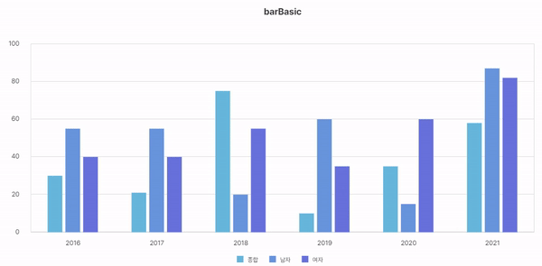

> 왼쪽에서 오른쪽으로 아래쪽에서 위쪽으로 애니메이션이 동시에
> 일어납니다.

기본적인 애니메이션 초당 Frame은 90입니다.

```javascript
 var bar= New DxChartBar(config);                               
 bar.wave ();
```

### grow

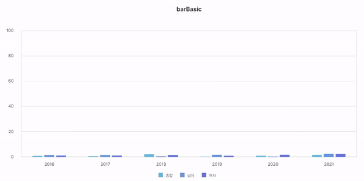

> 아래쪽 또는 위쪽으로 애니메이션이 일어납니다. 기본적인 애니메이션 초당
> Frame은 60입니다.
```javascript
 var bar= New DxChartBar(config);
 bar.grow ();
```


### trace

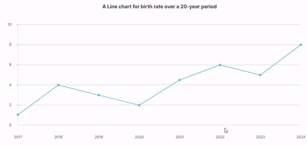

> 왼쪽에서 오른쪽으로 애니메이션이 일어납니다. (적용 대상 차트 : line ,
> scatter , rader)

```javascript
 var line= New DxChartLine(config);
 line. trace();
```

### unfold (toBottom)

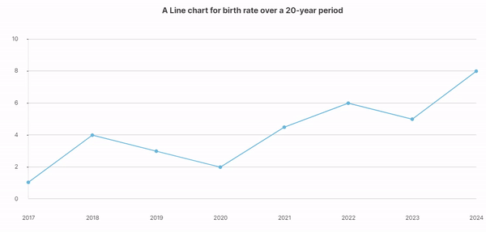

> 아래쪽으로 애니메이션이 일어납니다. (적용 대상 차트 : line)


```javascript
var line= New DxChartLine(config);
 line. unfold();
```
### unfoldFromCenterTrace (fromCenter)

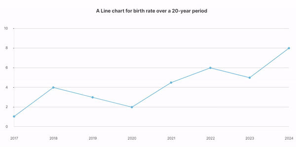

> 차트의 중앙에서부터 원래의 값으로 이동하는 애니메이션이 일어납니다.
> (적용 대상 차트 : line)

```javascript
 var line= New DxChartLine(config);
 line. unfoldFromCenterTrace();
 ```

### foldtocenter (toCenter)

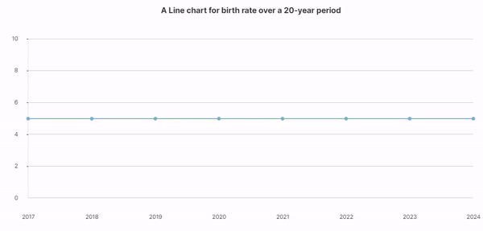

> 차트의 원래의 값에서부터 중앙으로 이동하는 애니메이션이 일어납니다.
> (적용 대상 차트 : line)

```javascript
 var line= New DxChartLine(config);
 line. foldtocenter();
 ```


### roundRobin 및 roundRobinSequential

 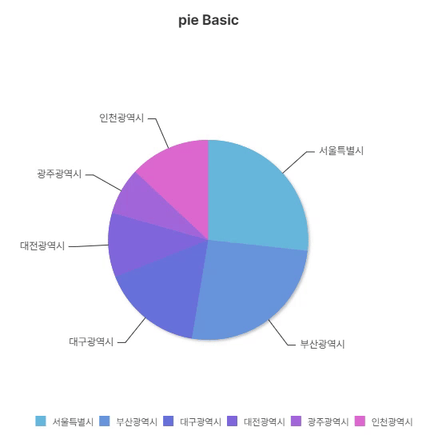
 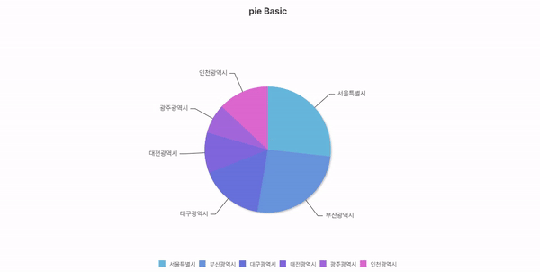

> 시계방향으로 돌아가면서 차트를 그리는 애니메이션이 일어납니다.
>
> roundRobin은 각각의 값이 조금씩 늘어나면서 파이의 각도가 점점
> 늘어나지만, roundRobinSequential은 하나의 값이 점점 늘어나면서 하나의
> 값이 전부 그려지면 다음 값이 늘어나면서 파이의 각도를 증가합니다.

```javascript
 var pie= New DxChartPie(config);
 pie.roundRobin();
// 적용 대상 차트 : pie , pieSegment, rose
```
### implode

 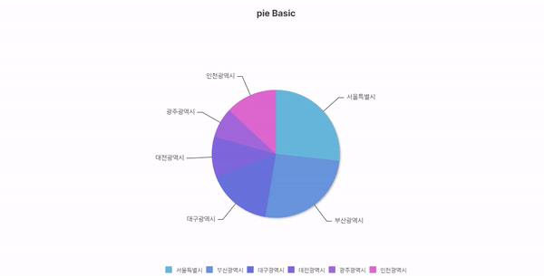

> 파이의 각 부분이 바깥으로부터 중심으로 모여 드는 애니메이션이
> 일어납니다.

```javascript
 var pie= New DxChartPie(config);
 pie.implode();

 
// 적용 대상 차트 : pie , pieSegment, rose

```
### explode

 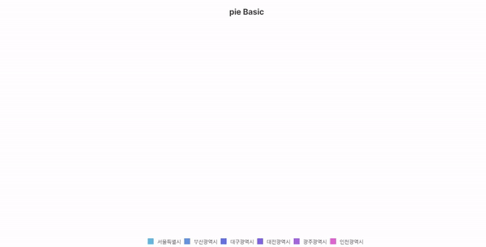

> 파이의 각 부분이 중심으로부터 바깥으로 퍼져 나가는 애니메이션이
> 일어납니다.


```javascript
var pie= New DxChartPie(config);
pie.explode()
```

### 차트 별 effect 종류

<table style="width: 100%; text-align: center; border-collapse: collapse;">
    <thead>
        <tr>
            <th>차트종류</th>
            <th>effect종류</th>
            <th>drawAni()의 첫번째 파라미터</th>
            <th>Default</th>
        </tr>
    </thead>
    <tbody>
        <tr>
            <td>activity</td>
            <td>grow</td>
            <td>grow</td>
            <td>grow</td>
        </tr>
        <tr>
            <td>bar</td>
            <td>wave</td>
            <td>wave</td>
            <td>grow</td>
        </tr>
        <tr>
            <td></td>
            <td>grow</td>
            <td>grow</td>
            <td></td>
        </tr>
        <tr>
            <td>bipolar</td>
            <td>wave</td>
            <td>wave</td>
            <td>grow</td>
        </tr>
        <tr>
            <td></td>
            <td>grow</td>
            <td>grow</td>
            <td></td>
        </tr>
        <tr>
            <td>fuel</td>
            <td>grow</td>
            <td>grow</td>
            <td>grow</td>
        </tr>
        <tr>
            <td>funnel</td>
            <td>-</td>
            <td>-</td>
            <td>draw</td>
        </tr>
        <tr>
            <td>gauge</td>
            <td>grow</td>
            <td>grow</td>
            <td>grow</td>
        </tr>
        <tr>
            <td>gantt</td>
            <td>grow</td>
            <td>grow</td>
            <td>grow</td>
        </tr>
        <tr>
            <td>hbar</td>
            <td>grow</td>
            <td>grow</td>
            <td>grow</td>
        </tr>
        <tr>
            <td></td>
            <td>wave</td>
            <td>wave</td>
            <td></td>
        </tr>
        <tr>
            <td>horseshoe</td>
            <td>grow</td>
            <td>grow</td>
            <td>grow</td>
        </tr>
        <tr>
            <td>hprogress</td>
            <td>grow</td>
            <td>grow</td>
            <td>grow</td>
        </tr>
        <tr>
            <td>line</td>
            <td>unfold</td>
            <td>unfold (toBottom)</td>
            <td>wave(toTop)</td>
        </tr>
        <tr>
            <td></td>
            <td>unfoldfromcentertrace</td>
            <td>unfoldfromcentertrace (fromCenter)</td>
            <td></td>
        </tr>
        <tr>
            <td></td>
            <td>foldtocenter</td>
            <td>foldtocenter (toCenter)</td>
            <td></td>
        </tr>
        <tr>
            <td></td>
            <td>trace</td>
            <td>trace (toRight)</td>
            <td></td>
        </tr>
        <tr>
            <td></td>
            <td>wave</td>
            <td>wave (toTop)</td>
            <td></td>
        </tr>
        <tr>
            <td>meter</td>
            <td>grow</td>
            <td>grow</td>
            <td>grow</td>
        </tr>
        <tr>
            <td>odo</td>
            <td>grow</td>
            <td>grow</td>
            <td>grow</td>
        </tr>
        <tr>
            <td>pie</td>
            <td>grow</td>
            <td>grow</td>
            <td>grow</td>
        </tr>
        <tr>
            <td></td>
            <td>explode</td>
            <td>explode</td>
            <td></td>
        </tr>
        <tr>
            <td></td>
            <td>roundrobin</td>
            <td>roundRobin</td>
            <td></td>
        </tr>
        <tr>
            <td></td>
            <td>roundRobinSequential</td>
            <td>roundRobinSequential</td>
            <td></td>
        </tr>
        <tr>
            <td></td>
            <td>implode</td>
            <td>implode</td>
            <td></td>
        </tr>
        <tr>
            <td>pieSegment</td>
            <td>grow</td>
            <td>grow</td>
            <td>grow</td>
        </tr>
        <tr>
            <td></td>
            <td>explode</td>
            <td>explode</td>
            <td></td>
        </tr>
        <tr>
            <td></td>
            <td>roundrobin</td>
            <td>roundRobin</td>
            <td></td>
        </tr>
        <tr>
            <td></td>
            <td>roundRobinSequential</td>
            <td>roundRobinSequential</td>
            <td></td>
        </tr>
        <tr>
            <td></td>
            <td>implode</td>
            <td>implode</td>
            <td></td>
        </tr>
        <tr>
            <td>radar</td>
            <td>grow</td>
            <td>grow</td>
            <td>grow</td>
        </tr>
        <tr>
            <td></td>
            <td>trace</td>
            <td>trace</td>
            <td></td>
        </tr>
        <tr>
            <td>rose</td>
            <td>grow</td>
            <td>grow</td>
            <td>grow</td>
        </tr>
        <tr>
            <td></td>
            <td>roundRobin</td>
            <td>roundRobin</td>
            <td></td>
        </tr>
        <tr>
            <td></td>
            <td>implode</td>
            <td>implode</td>
            <td></td>
        </tr>
        <tr>
            <td></td>
            <td>explode</td>
            <td>explode</td>
            <td></td>
        </tr>
        <tr>
            <td>rscatter</td>
            <td>-</td>
            <td></td>
            <td>draw</td>
        </tr>
        <tr>
            <td>scatter</td>
            <td>trace</td>
            <td>trace</td>
            <td>trace</td>
        </tr>
        <tr>
            <td></td>
            <td>explode</td>
            <td>explode</td>
            <td></td>
        </tr>
        <tr>
            <td>semicircularprogress</td>
            <td>grow</td>
            <td>grow</td>
            <td>grow</td>
        </tr>
        <tr>
            <td>segment</td>
            <td>grow</td>
            <td>grow</td>
            <td>grow</td>
        </tr>
        <tr>
            <td>thermometer</td>
            <td>grow</td>
            <td>grow</td>
            <td>grow</td>
        </tr>
        <tr>
            <td>vprogress</td>
            <td>grow</td>
            <td>grow</td>
            <td>grow</td>
        </tr>
        <tr>
            <td>waterfall</td>
            <td>grow</td>
            <td>grow</td>
            <td>grow</td>
        </tr>
        <tr>
            <td>org</td>
            <td>grow</td>
            <td>grow</td>
            <td>grow</td>
        </tr>
        <tr>
            <td>tree</td>
            <td>grow</td>
            <td>grow</td>
            <td>grow</td>
        </tr>
        <tr>
            <td>heatmap</td>
            <td>grow</td>
            <td>grow</td>
            <td>grow</td>
        </tr>
        <tr>
            <td>sunburst</td>
            <td>grow</td>
            <td>grow</td>
            <td>grow</td>
        </tr>
        <tr>
            <td>pyramid</td>
            <td>-</td>
            <td></td>
            <td>draw</td>
        </tr>
        <tr>
            <td>map</td>
            <td>-</td>
            <td></td>
            <td>draw</td>
        </tr>
    </tbody>
</table>

<br><br>

# **Multi Chart 생성하기**

### Bar 및 Line 차트

 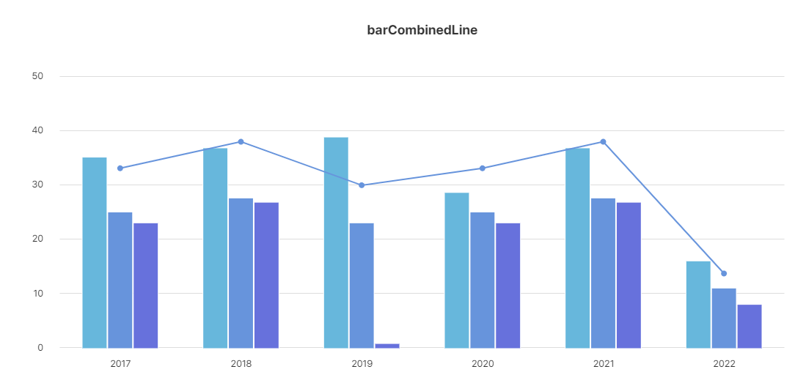

```javascript
var bar = new DxChartBar({
    id: cvs,
    elem: canvas,
    binddataset: this.Dataset00_00,
    data: ["bind:seoul", "bind:busan", "bind:daegu"],
    options: {
        margin: { Left: 105, Right: 55, Top: 135, Inner: 30, Bottom: 82 },
        xaxis: {
            Use: false,
            Labels: ['bind:year'],
            ScaleZerostart: true,
            Color: "#E2E2E2",
            LabelsOffsetY: 5,
            Tickmarks: false
        },
        colorsStroke: 'white',
        linewidth: 2,
        shadow: { Offsetx: 1, Offsety: 0, Blur: 1 },
        background: { GridVlines: false, GridBorder: false },
        yaxis: {
            Use: false,
            Color: "#E2E2E2",
            LabelsOffsetX: -15,
            Tickmarks: false,
            ScaleMax: 50
        },
        title: { Text: 'barCombinedLine', Y: 73 },
        combinedEffect: 'wave',
        combinedEffectOptions: '{frames: 90}',
        tooltips: {
            Data: '%{value_formatted}',
            Effect: 'fade',
            Pointer: false,
            FormattedUnitsPost: '%'
        }
    }
});

var line = new DxChartLine({
    id: cvs,
    elem: canvas,
    binddataset: this.Dataset00_00,
    data: ['bind:total'],
    options: {
        colors: ["#6794DC"],
        spline: true,
        tickmarksStyle: 'filledcircle',
        yaxisScaleMax: 40,
        shadow: false,
        xaxis: false,
        yaxis: false,
        combinedEffect: 'trace',
        combinedEffectOptions: '{frames: 90}',
        tooltips: {
            Data: '%{value}',
            Effect: 'fade',
            Pointer: true
        }
    }
});

var combo = new DxChart.CombinedChart(bar, line);
combo.draw();
```

> 1. 각각 bar와 Line의 object를 생성합니다.
> 2. DxChart.CombinedChart를 통해 margin 값 계산 후 함께 그려집니다.

### Bar 및 Pie 차트

 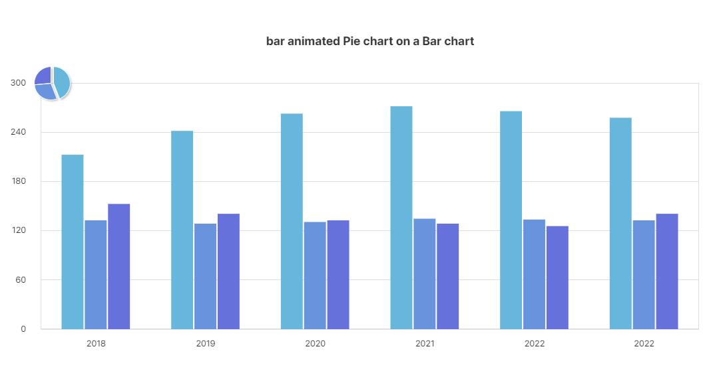

```javascript
var bar = new DxChartBar({
    id: cvs,
    elem: canvas,
    binddataset: this.Dataset00,
    data: ["bind:child", "bind:middle", "bind:high"],
    options: {
        margin: { Left: 105, Right: 55, Top: 135, Inner: 30, Bottom: 82 },
        title: { Text: 'bar animated Pie chart on a Bar chart', Y: 73 },
        xaxis: {
            Labels: ['bind:year'],
            ScaleMax: 200,
            Color: "#E2E2E2",
            LabelsOffsetY: 5,
            Tickmarks: false
        },
        yaxis: {
            Use: false,
            Color: "#E2E2E2",
            LabelsOffsetX: -15,
            Tickmarks: false
        },
        colorsStroke: 'rgba(0,0,0,0)',
        background: { GridVlines: false }
    }
}).draw();

var pie = new DxChartPie({
    id: cvs,
    elem: canvas,
    binddataset: this.Dataset00,
    data: ["bind:pieValue"],
    options: {
        center: { x: 120, y: bar.get('marginTop') },
        radius: 25,
        exploded: [5],
        colorsStroke: 'rgba(0,0,0,0)',
        colorsStroke: '#fff',
        shadow: false,
        linewidth: 1
    }
}).roundRobin({ frames: 60 });
```

> 1. 각각 bar와 pie의 object를 생성합니다.
> 2. DxChart.CombinedChart를 사용하지 않고 margin 값으로 설정하여 함께
> 생성하였습니다.


<style>
    table {
        border-collapse: collapse;
        width: 80%;
        margin: auto; /* 테이블을 가운데 정렬 */
    }
    th, td {
        border: 1px solid black;
        text-align: center; /* 텍스트를 가운데 정렬 */
        padding: 10px;
    }
    th {
        background-color: #f2f2f2;
    }
</style>