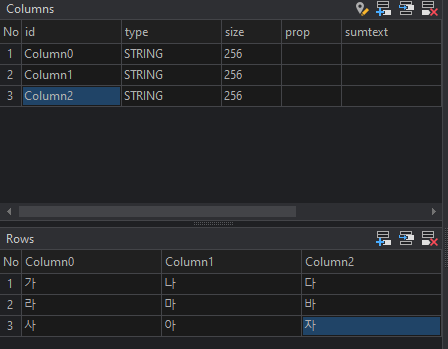

> **DXChart 개발자 튜토리얼**
>
> **(Nexacro용)**
---

**\[목 차\]**
각각의 목차를 클릭시 해당 페이지로 이동합니다

[**5.** **기타기능** ](#기타기능)

- [**기타기능**](#기타기능)
    - [convertDataset](#convertdataset)
    - [datachangeevent](#datachangeevent)


# **기타기능**

### convertDataset

> DataSet을 배열로 반환하는 메서드입니다. bind로 개발 시 어려울 때
> 유용하게 사용가능합니다.

<table>
  <thead>
    <tr>
      <th>함수명</th>
      <th>Argument</th>
      <th>Type</th>
      <th>설명</th>
    </tr>
  </thead>
  <tbody>
    <tr>
      <td rowspan="4">ConvertDataset</td>
      <td>dataset</td>
      <td>Object</td>
      <td>Dataset object</td>
    </tr>
    <tr>
      <td>arrCol</td>
      <td>Array</td>
      <td>변환할 데이터셋 컬럼 명</td>
    </tr>
    <tr>
      <td>nDiv</td>
      <td>Number</td>
      <td>(옵션) 반복 행 설정</td>
    </tr>
    <tr>
      <td>Option</td>
      <td>String</td>
      <td>(옵션) "linear" 설정 시 컬럼 별 데이터 생성</td>
    </tr>
  </tbody>
</table>

<br>

 > Dataset00 의 구조




>예시 1) linear 미설정 시

```javascript
  var arrData =
  DxChart.convertDataset(this.Dataset00,["bind:Column0","bind:Column1","bind:Column2"]);
```

 

**결과값**

```javascript
arrData =[[가,나,다],[라,마,바],[사,아,자]]
```

> 예시 2) linear 설정 시

```javascript
  var arrData = 
  DxChart.convertDataset(this.Dataset00,["bind:Column0","bind:Column1","
  bind:Column2"],null,"linear");
  ```


 

**결과값**

```javascript
arrData =[[가,라,사],[나,마,아],[다,바,자]]
```


### datachangeevent

기존 Chart에 Bindding 되어있는 Dataset의 값이 변경 되었을 때 차트에 바로
적용해주는 속성입니다.

<table>
  <thead>
    <tr>
      <th>property</th>
      <th>Sub Property</th>
      <th>설명</th>
      <th>타입</th>
      <th>기본값</th>
    </tr>
  </thead>
  <tbody>
    <tr>
      <td rowspan="2">datachangeevent</td>
      <td>Use</td>
      <td>Datachangeevent를 사용할 지 여부입니다.</td>
      <td>Boolean</td>
      <td>null</td>
    </tr>
    <tr>
      <td>Effect</td>
      <td>Datachangeevent 발생 시 Chart의 Effect를 설정합니다.</td>
      <td>string</td>
      <td>draw</td>
    </tr>
  </tbody>
</table>
<br>

```javascript
var bar = new DxChartBar({
  id: cvs,
  elem: canvas,
  binddataset: this.Dataset00,
  data: ["bind:total", "bind:man", "bind:woman"],
  datachangeevent: {
    Use: true // datachangeevent 사용 설정합니다.
    ,Effect: "draw" // datachangeevent 발생 시 Effect를 설정합니다.
  },
  options: {// 기존 예제와 동일합니다.}
  }).wave();
```


<style>
    table {
        border-collapse: collapse;
        width: 80%;
        margin: auto; /* 테이블을 가운데 정렬 */
    }
    th, td {
        border: 1px solid black;
        text-align: center; /* 텍스트를 가운데 정렬 */
        padding: 10px;
    }
    th {
        background-color: #f2f2f2;
    }
</style>


