> **DXChart 개발자 튜토리얼**
>
> **(Nexacro용)**


**\[목 차\]**
각각의 목차를 클릭시 해당 페이지로 이동합니다

 [**1.** **DxChart 준비하기**](#dxchart-준비하기)
  - [Nexacro Project 만들기](#nexacro-project-만들기)
  - [차트모듈 설치하기](#차트모듈-설치하기)
  - [샘플화면 만들기](#샘플화면-만들기)
  
[**2.** **차트함수 만들기**](#차트함수-만들기)

[**3.** **차트 구성요소**](#차트-구성요소)
- [**DxChart 준비하기**](#dxchart-준비하기)
  - [Nexacro Project 만들기](#nexacro-project-만들기)
  - [차트모듈 설치하기](#차트모듈-설치하기)
  - [샘플화면 만들기](#샘플화면-만들기)
  - [**차트함수 만들기**](#차트함수-만들기)
- [**차트 구성요소**](#차트-구성요소)
  - [구성요소 용어 설명](#구성요소-용어-설명)
  - [데이터 형식](#데이터-형식)
    - [data Property](#data-property)
    - [binddataset Property](#binddataset-property)


# **DxChart 준비하기**

## Nexacro Project 만들기

차트를 사용하기 위한 테스트 프로젝트를 생성합니다.

넥사크로스튜디오가 설치되지 않은 경우에는 설치를 먼저 진행해야 합니다.

(<http://support.tobesoft.com>에서 다운로드 받아 설치할 수 있습니다.)

1)  NexacroStudio를 기동합니다.

2)  새로운 프로젝트를 생성합니다.

    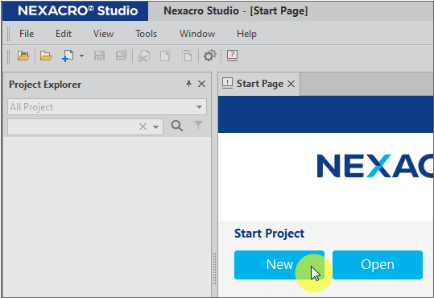

3)  새로운 창이 열리면 Project Name 항목에 프로젝트 이름을 입력하고
    [Next] 버튼을 클릭합니다.

    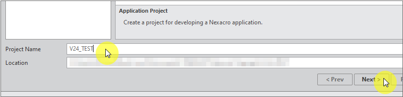)

4)  Screen 설정값은 기본값으로 놔두고 [Next] 버튼을 클릭합니다.

    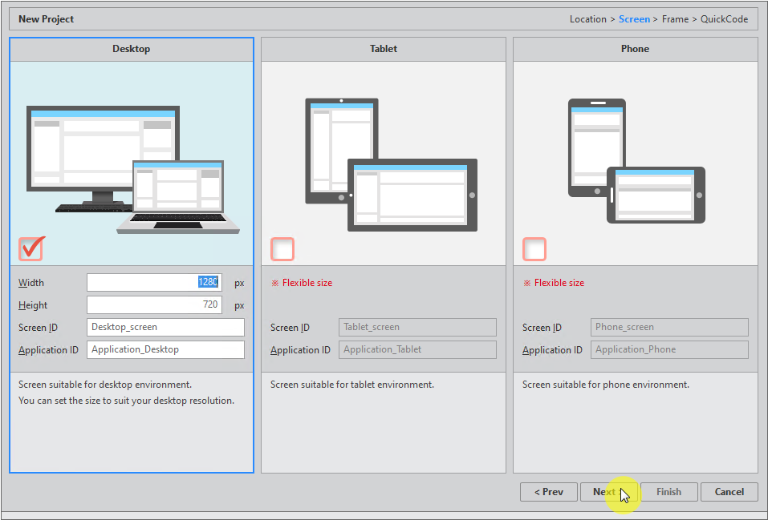

5)  Frame 설정값도 기본값으로 놔두고 [Finish] 버튼을 클릭합니다.

    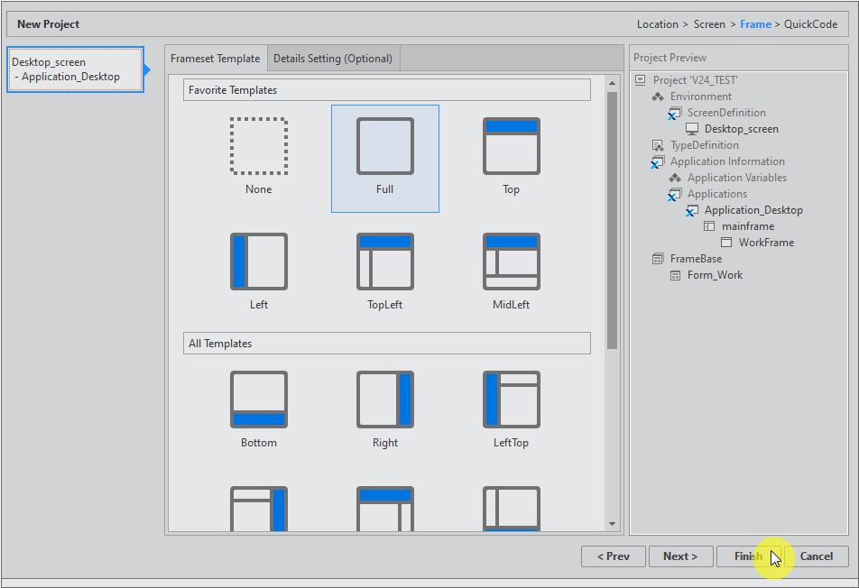

6)  Project Explorer 영역에 앞에서 입력한 프로젝트명으로 프로젝트가
    생성된 것을 확인합니다.

    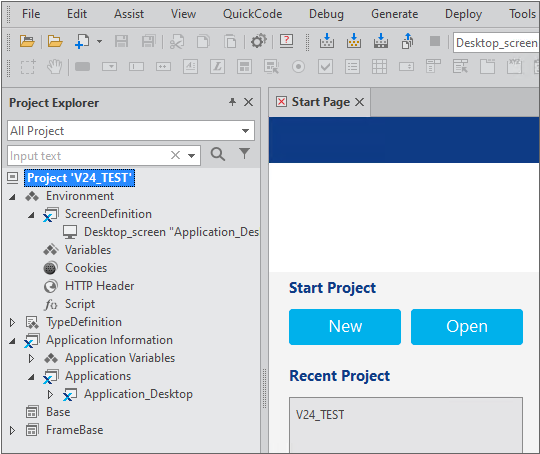

## 차트모듈 설치하기

1)  Nexacro Studio에서 [File]-[install module]을 선택합니다.

2)  [Module Package(.xmodule)]을 선택하고 [Next]를 클릭합니다.

    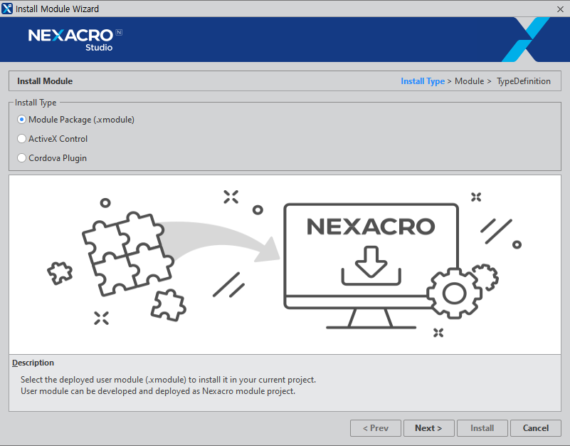

3)  준비된 DxChart.xmodule파일을 선택하고 [Next]를 클릭합니다.

    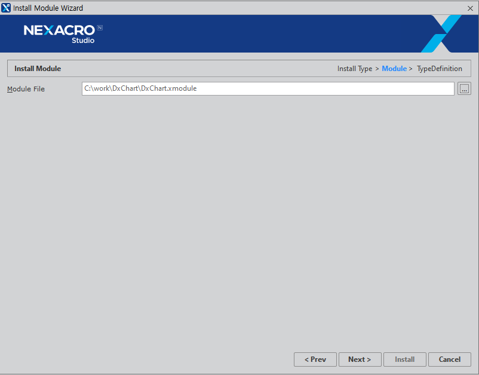

4)  [Install]버튼을 클릭합니다.

    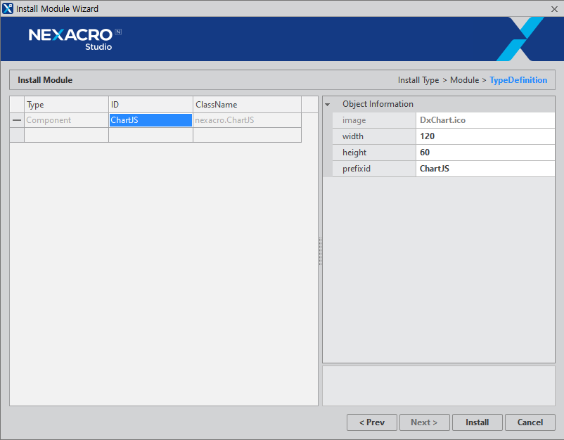

5)  [Finish]버튼을 클릭합니다.

    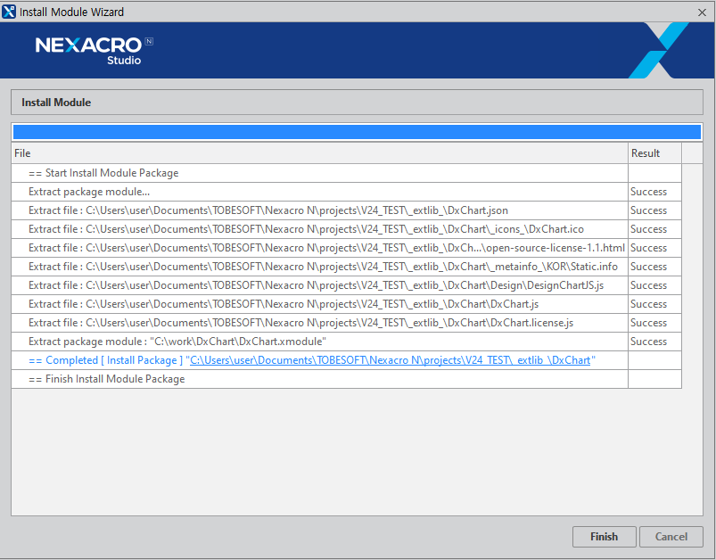

6)  설치가 끝나면 프로젝트 파일을 Reload할지를 묻는 Confirm메시지가
    표시됩니다.

    [Yes]를 클릭합니다.

    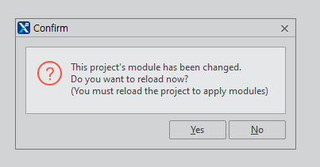

7)  DXChart가 설치된 것을 확인합니다.

-   [Project Explorer]-[TypeDefinition]-[Objects]를 선택하면
    [TypeDefinition-Objects]팝업이 표시됩니다.

-   [Modlues] 에 "extlib::DxChart.json"이 추가된 것을 확인합니다.

-   [Objects]에 "ChartJS"가 추가되어 있는 것을 확인합니다.

    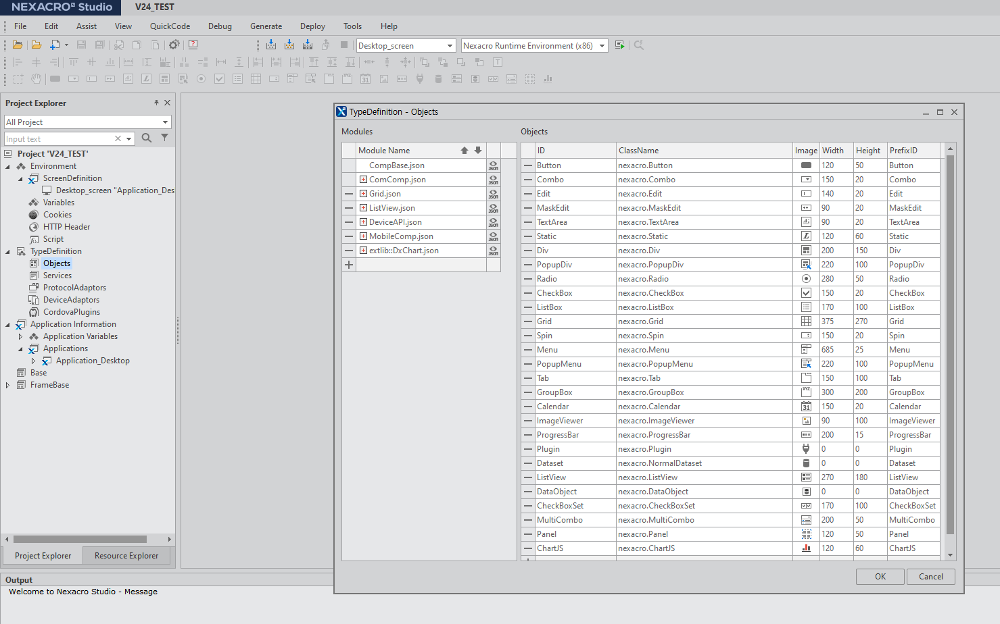

## 샘플화면 만들기

1)  작성할 화면을 오픈합니다. (FrameBase::Frame_Work.xfdl)

    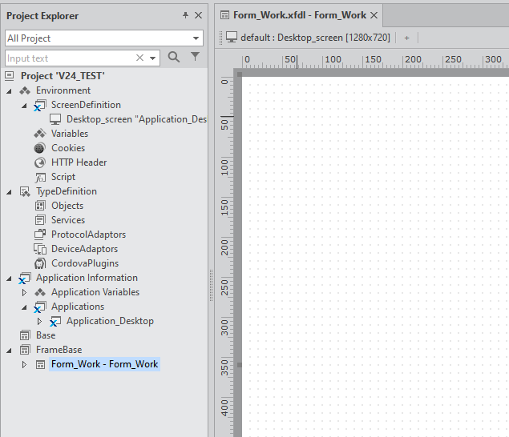

2)  Chart 컴포넌트를 추가합니다.

    컴포넌트의 아이디는 변경을 하지 않으면 기본적으로 "ChartJS00"으로
    생성됩니다.

    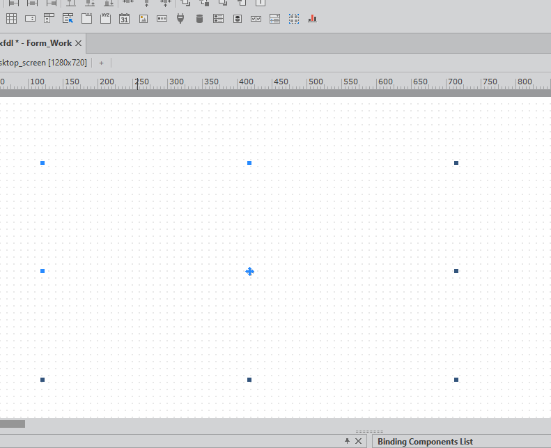

3)  버튼을 추가합니다.

    컴포넌트의 아이디는 변경을 하지 않으면 기본적으로 "Button00"으로
    생성됩니다.

    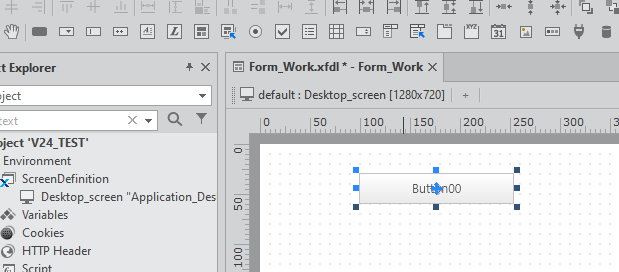

4)  데이터 생성하기

    표시할 데이터를 생성합니다. (데이터셋 사용)

    컴포넌트의 아이디는 변경을 하지 않으면 기본적으로 "Dataset00"으로
    생성됩니다.

    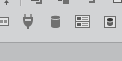

5)  Dataset을 추가한 후 데이터셋을 더블클릭하면, [Dataset Editor]창이
    표시됩니다.

    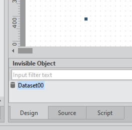

6)  [Dataset Editor]창 하단의 [Source]탭을 클릭합니다.

    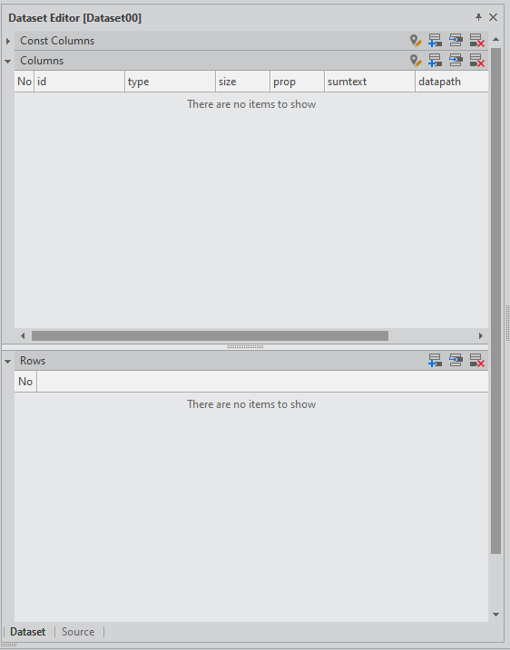

7)  [Dataset Source Editor]팝업이 표시됩니다.

    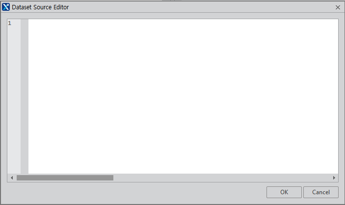

8)  아래의 내용을 창에 입력 후 [OK]를 클릭합니다.

    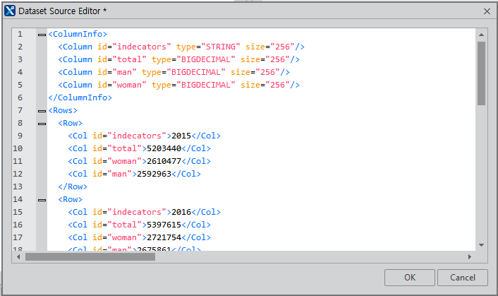

```html 
    [데이터셋 내용]
    <ColumnInfo>
      <Column id="indecators" type="STRING" size="256"/>
      <Column id="total" type="BIGDECIMAL" size="256"/>
      <Column id="man" type="BIGDECIMAL" size="256"/>
      <Column id="woman" type="BIGDECIMAL" size="256"/>
    </ColumnInfo>
    <Rows>
      <Row>
        <Col id="indecators">2015</Col>
        <Col id="total">5203440</Col>
        <Col id="woman">2610477</Col>
        <Col id="man">2592963</Col>
      </Row>
      <Row>
        <Col id="indecators">2016</Col>
        <Col id="total">5397615</Col>
        <Col id="woman">2721754</Col>
        <Col id="man">2675861</Col>
      </Row>
      <Row>
        <Col id="indecators">2017</Col>
        <Col id="total">5618677</Col>
        <Col id="woman">2826828</Col>
        <Col id="man">2791849</Col>
      </Row>
      <Row>
        <Col id="indecators">2018</Col>
        <Col id="total">5848594</Col>
        <Col id="woman">2942274</Col>
        <Col id="man">2906320</Col>
      </Row>
      <Row>
        <Col id="indecators">2019</Col>
        <Col id="total">6147516</Col>
        <Col id="woman">3093783</Col>
        <Col id="man">3053733</Col>
      </Row>
      <Row>
        <Col id="indecators">2020</Col>
        <Col id="total">6643354</Col>
        <Col id="woman">3338956</Col>
        <Col id="man">3304398</Col>
      </Row>
      <Row>
        <Col id="indecators">2021</Col>
        <Col id="total">7165788</Col>
        <Col id="woman">3582018</Col>
        <Col id="man">3583770</Col>
      </Row>
    </Rows>
  ```

  ##  **차트함수 만들기**

1) 생성한 버튼을 더블클릭하고 스크립트를 작성합니다.

    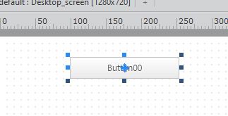

2) [버튼 처리 내용]

    
    
  ```javascript
   this.Button00_onclick = function(obj:nexacro.Button,e:nexacro.ClickEventInfo)
      {
      var chart = this.ChartJS00;
      var canvas = chart.getCanvas();
      var cvs = canvas.id;
      DxChart.reset(canvas);
      var labels = DxChart.convertDataset(this.Dataset00, ["bind:indecators"])
      var line = new DxChartBar({
        id: cvs,
        elem : canvas,
        binddataset : this.Dataset00,
        data:["bind:total","bind:man","bind:woman"],
        options: {
              colors: ['#FF6A8E','#42B0FF','#5DCA63'],
              title: { 
                    Text : '1인 가구 수', 
                    FontStyle: 'bold 12px Tahoma' 
              },
              xaxis: { 
                    Use : true, 
                    Labels: labels 
              },
              yaxis: { 
                    Use : true,
                    LabelsCount: 5,
                    ScaleMax: 10000000,
                     TickmarksCount: 10,
              },
            margin: { 
                    Left: 100, 
                    Bottom: 50, 
                    Inner : 20 
              },
            tooltips: {
                    Data : '%{key}',
                    FormattedUnitsPost: '명',
                    Effect : 'fade',
                    Pointer : true,
                    Css: {
                      fontSize: '14pt'
                    },
                    FormattedKeyLabels: ['종합','남자','여자'],
            }
          }
        }).wave();
      }
```
  
3) 테스트해보기
 
    Quick View를 실행합니다.(Browser는 Chrome 또는 Microsoft Edge을
    선택합니다.)

    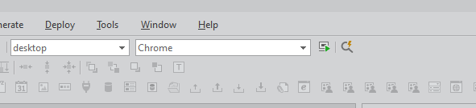

    [실행 결과]


4)  버튼을 클릭합니다.


5)  결과를 확인합니다.

    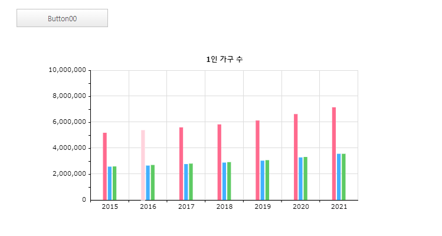


---


# **차트 구성요소**

## 구성요소 용어 설명

차트의 호출형식은 아래와 같이 구성되어 있습니다.

  ```javascript
        var chart = this.chart; 
        var canvas = chart.getCanvas(); 
        var cvs = canvas.id;
        DxChart.reset(canvas);
        var bar = new DxChartBar({
          id: cvs,
          elem : canvas,
          binddataset : this.Dataset00,
          data:["bind:total","bind:man","bind:woman"],
          options: {
              colors: ['#FF6A8E','#42B0FF','#5DCA63'],
              title: { Text : '1인 가구 수' },
                xaxis: { Use : true, Labels: labels },
                  yaxis: { Use : true,
                    LabelsCount: 5,
              ScaleMax: 10000000,
              TickmarksCount: 10,
              },
              margin: { Left: 100, Bottom: 50, Inner : 20 },
          }
        }).wave();


        1)  차트를 그리기 전에 차트영역을 reset해줍니다.

            var chart = this.chart; // Chart Object를 지정합니다.

            var canvas = chart.getCanvas(); // canvas를 가져옵니다.

            var cvs = canvas.id; // cavas의 아이디

            DxChart.reset(canvas); // 차트영역(canvas)을 reset합니다.

        2)  차트의 종류(오브젝트)를 지정합니다.

            var bar = New DxChartBar(config);

            //config : 차트를 그리기 위한 정보(config)

```
---

  1) 지정가능한 차트의 종류는 아래와 같습니다.


      <table>
        <thead>
          <tr>
            <th style="text-align: center;">차트 종류</th>
            <th style="text-align: center;">오브젝트명</th>
          </tr>
        </thead>
        <tbody>
          <tr>
            <td style="text-align: center;">activity 차트</td>
            <td style="text-align: center;">DxChartActivity</td>
          </tr>
          <tr>
            <td style="text-align: center;">막대 차트</td>
            <td style="text-align: center;">DxChartBar</td>
          </tr>
          <tr>
            <td style="text-align: center;">양극성 차트</td>
            <td style="text-align: center;">DxChartBipolar</td>
          </tr>
          <tr>
            <td style="text-align: center;">연료 차트</td>
            <td style="text-align: center;">DxChartFuel</td>
          </tr>
          <tr>
            <td style="text-align: center;">Funnel 차트</td>
            <td style="text-align: center;">DxChartFunnel</td>
          </tr>
          <tr>
            <td style="text-align: center;">간트 차트</td>
            <td style="text-align: center;">DxChartGantt</td>
          </tr>
          <tr>
            <td style="text-align: center;">게이지 차트</td>
            <td style="text-align: center;">DxChartGauge</td>
          </tr>
          <tr>
            <td style="text-align: center;">가로 막대 차트</td>
            <td style="text-align: center;">DxChartHbar</td>
          </tr>
          <tr>
            <td style="text-align: center;">히트맵 차트</td>
            <td style="text-align: center;">DxChartHeatmap</td>
          </tr>
          <tr>
            <td style="text-align: center;">말발굽 차트</td>
            <td style="text-align: center;">DxChartHorseshoe</td>
          </tr>
          <tr>
            <td style="text-align: center;">수평 진행 차트</td>
            <td style="text-align: center;">DxChartHProgress</td>
          </tr>
          <tr>
            <td style="text-align: center;">선 차트</td>
            <td style="text-align: center;">DxChartLine</td>
          </tr>
          <tr>
            <td style="text-align: center;">미터 차트</td>
            <td style="text-align: center;">DxChartMeter</td>
          </tr>
          <tr>
            <td style="text-align: center;">계기판 차트</td>
            <td style="text-align: center;">DxChartOdo</td>
          </tr>
          <tr>
            <td style="text-align: center;">조직구조 차트</td>
            <td style="text-align: center;">DxChartOrg</td>
          </tr>
          <tr>
            <td style="text-align: center;">파이 차트</td>
            <td style="text-align: center;">DxChartPie</td>
          </tr>
          <tr>
            <td style="text-align: center;">피라미드 차트</td>
            <td style="text-align: center;">DxChartPyramid</td>
          </tr>
          <tr>
            <td style="text-align: center;">레이더 차트</td>
            <td style="text-align: center;">DxChartRadar</td>
          </tr>
          <tr>
            <td style="text-align: center;">로즈 차트</td>
            <td style="text-align: center;">DxChartRose</td>
          </tr>
          <tr>
            <td style="text-align: center;">산점도 차트</td>
            <td style="text-align: center;">DxChartRscatter</td>
          </tr>
          <tr>
            <td style="text-align: center;">분산형 차트</td>
            <td style="text-align: center;">DxChartScatter</td>
          </tr>
          <tr>
            <td style="text-align: center;">세그먼트 차트</td>
            <td style="text-align: center;">DxChartSegment</td>
          </tr>
          <tr>
            <td style="text-align: center;">반원형 진행 차트</td>
            <td style="text-align: center;">DxChartSemiCircle</td>
          </tr>
          <tr>
            <td style="text-align: center;">온도계 차트</td>
            <td style="text-align: center;">DxChartThermometer</td>
          </tr>
          <tr>
            <td style="text-align: center;">트리 차트</td>
            <td style="text-align: center;">DxChartTree</td>
          </tr>
          <tr>
            <td style="text-align: center;">수직 진행 차트</td>
            <td style="text-align: center;">DxChartVProgress</td>
          </tr>
          <tr>
            <td style="text-align: center;">워터폴 차트</td>
            <td style="text-align: center;">DxChartWaterfall</td>
          </tr>
        </tbody>
      </table>


---


1)  config를 정의합니다.

-   Config는 JSON형식으로 구성이 되어 있습니다.

-   Config는 아래의 구성요소로 되어 있습니다.

<table>
  <thead>
    <tr>
      <th style="text-align: center;">구성요소명</th>
      <th style="text-align: center;">설명</th>
      <th style="text-align: center;">사용예</th>
    </tr>
  </thead>
  <tbody>
    <tr>
      <td style="text-align: center;">id</td>
      <td style="text-align: center;">차트 canvas의 아이디</td>
      <td style="text-align: center;">Id : canvas.id</td>
    </tr>
    <tr>
      <td style="text-align: center;">elem</td>
      <td style="text-align: center;">차트 canvas 오브젝트</td>
      <td style="text-align: center;">elem: this.chart00.getCanvas()</td>
    </tr>
    <tr>
      <td style="text-align: center;">binddataset</td>
      <td style="text-align: center;">Nexacro의 데이터셋 오브젝트</td>
      <td style="text-align: center;">Binddataset:</td>
    </tr>
    <tr>
      <td style="text-align: center;">datachangeevent</td>
      <td style="text-align: center;">Bind된 데이터셋의 데이터가 변경되면 차트를 다시 그릴지를 확인합니다.<br>Use: 사용 여부(true/false(default))<br>Effect: 다시 그릴 때 사용할 effect함수명(String)</td>
      <td style="text-align: center;">datachangeevent: {Use: true, Effect: "wave"}</td>
    </tr>
    <tr>
      <td style="text-align: center;">data</td>
      <td style="text-align: center;">차트에 표시할 데이터 리스트(배열)<br>Binddataset이 세팅된 경우는 "bind" + 컬럼명을 지정하면 해당 컬럼의 데이터값이 배열로 세팅됩니다.</td>
      <td style="text-align: center;">- ["bind:Col0", "bind:Col1"]<br>- [[10,20,30], [20,30,40]]</td>
    </tr>
    <tr>
      <td style="text-align: center;">option</td>
      <td style="text-align: center;">차트에 대한 옵션값을 세팅합니다.<br>- background, key, xaxis, yaxis, tooltip 등</td>
      <td style="text-align: center;">{<br>xaxis: {...},<br>yaxis: {...},<br>key: {...},<br>...</td>
    </tr>
  </tbody>
</table>


## 데이터 형식

차트에 사용되는 데이터의 형식은 2차원 배열을 사용합니다.

### data Property
---

차트에 사용될 데이터를 지정합니다. 데이터의 지정방식을

bind컬럼지정/CSV배영/2차원배열등로 표현되어 지정 가능합니다.

형식: data : [ [첫번째 차트 데이터] , [두번째 차트 데이터] ,
[세번째 차트 데이터]]

사용 예 : data : ["bind:Column0","bind:Column1"] (binddataset을
지정한경우)

data: ["123,123,123,123","123,123,123,1234"] (CSV데이터의 배열)

data: [[123,123,123,123],[123,123,123,1234]] (2차원 배열)

---
### binddataset Property
---
데이터셋의 오브젝트를 지정합니다.

이 Property를 사용하는 경우, 일부 Property에서는 "bind: 컬럼명"형태로

데이터의 리스트(배열)을 지정할 수 있습니다.

(Nexacro 전용 프로퍼티)

사용 예 : binddataset : this.dsList

---